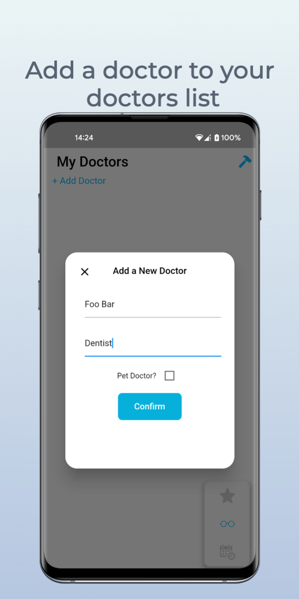
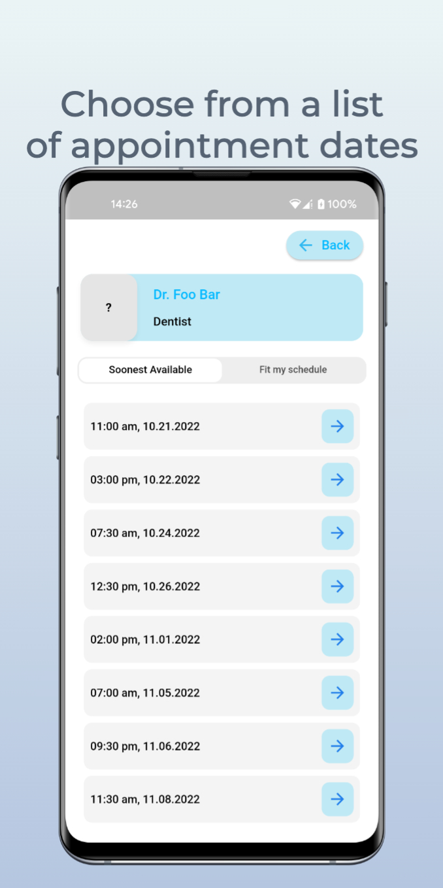
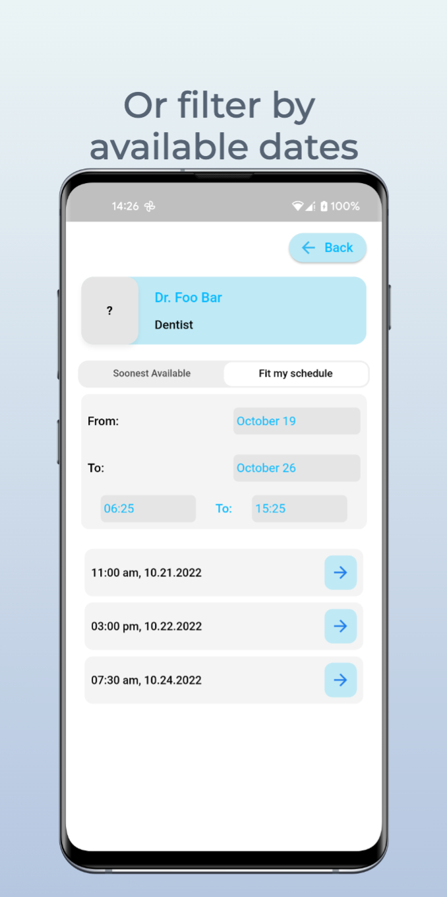
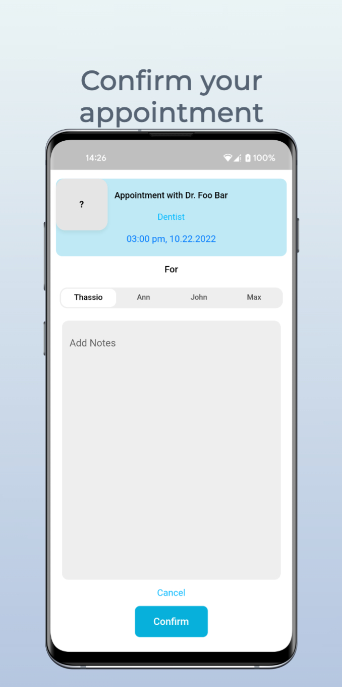
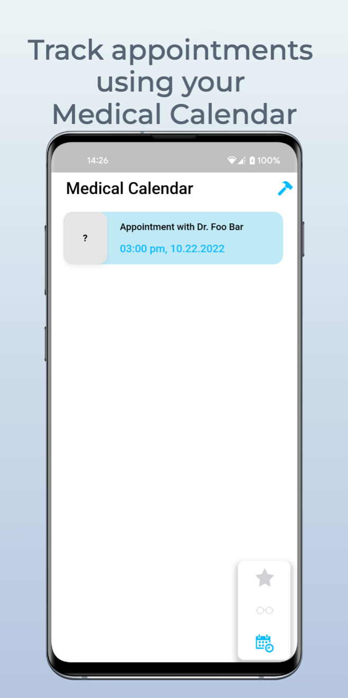

# appointments_app

A simple application for adding doctors to your doctors list, checking and creating medical appointments, as well as managing your medical schedule. Created with no commercial intentions, it uses a custom algorithm that returns random appointment dates and local storage to store user's login status and keep the user logged in.

Built with provider using the MVVM pattern and shared_preferences as the local storage.

### Project latest updates used below version
```
Doctor summary (to see all details, run flutter doctor -v):
[✓] Flutter (Channel stable, 3.3.4, on macOS 12.6 21G115 darwin-arm, locale en-GB)
[✓] Android toolchain - develop for Android devices (Android SDK version 32.0.0-rc1)
[✓] Xcode - develop for iOS and macOS (Xcode 14.0.1)
[✓] Chrome - develop for the web
[✓] Android Studio (version 2021.2)
[✓] VS Code (version 1.71.2)
[✓] Connected device (3 available)
[✓] HTTP Host Availability
```
### App screens preview







Mockups and templates created with [Previewed](https://previewed.app/)
